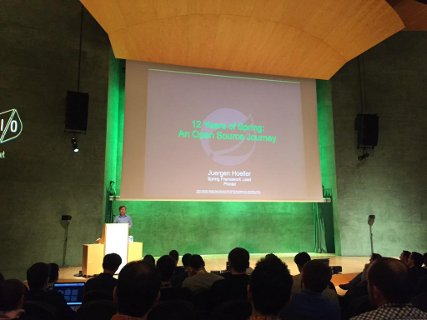
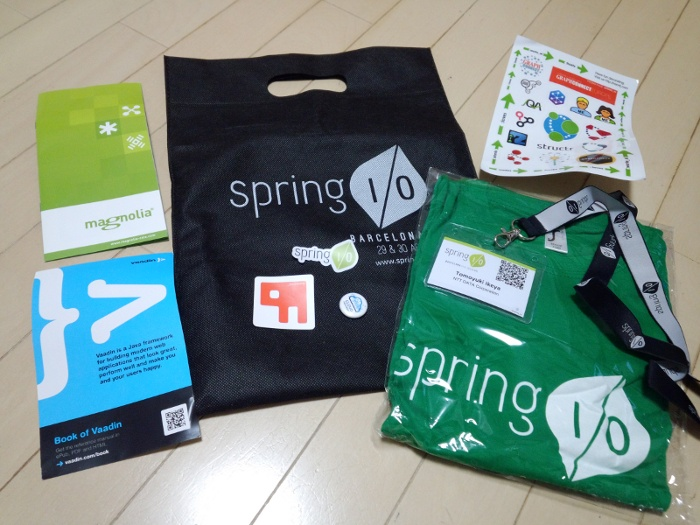
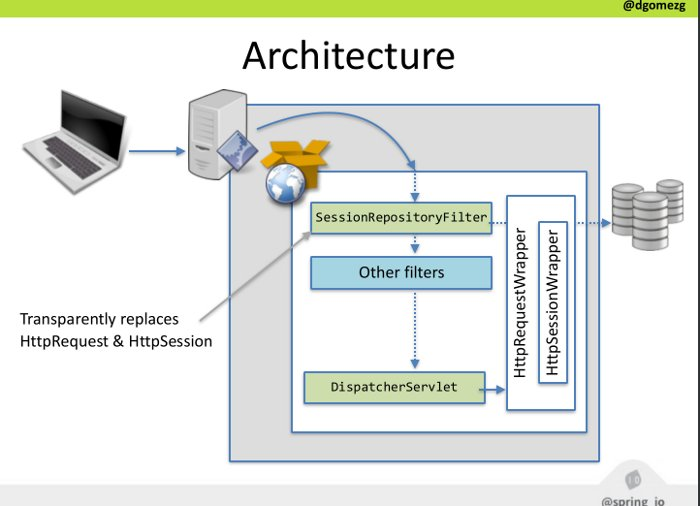

Spring I/O 2015報告会
=====

2015/6/22 JSUG

### agenda

|内容        |時間|発表者      |
|:-----------|:---|:-----------|
|概要        |5min|池谷        |
|Key Note 「Springの歴史」|10min|本橋  |
|Spring 4.2  |45min|岩塚、池谷  |
|セッションサマリ|20min|岩塚、池谷|

### 自己紹介

* 池谷 智行（いけや ともゆき）
* BASIC→VB→VC++→Java
* フレームワークに興味を持ち、なぜかSIerに入社@2010
* 初めてのSpringへの印象はXML地獄。
    * Annotation-drivenを知らなかった。
    * Java Based Configurationはまだ無かった。
* Spring Core/MVC/Boot/Batch/Dataに関心あり

### 概要

* 2015/4/29-30@バルセロナ
* 基調講演＋39セッション＋6ワークショップ
* 41プレゼンター（日本からは槙さん）
* Spring/Groovy/Grails
    * 2GXな皆様ごめんなさい
* 聴講者含めアジア系は我々4名のみの模様

### バルセロナ

* 偉大なるアーキテクト、ガウディの街
    * ガウディは女性恐怖症で生涯独身!?
* **来年のI/Oもバルセロナで開催するらしい**


### 会場

* AXA Auditorium
* 中心街から少し外れた場所なので、食事や観光に若干不便。




### 戦利品



Spring I/O 2015 Key Note 「Springの歴史」
---

### Spring I/O 2015 Key Note 「Springの歴史」

Spring 4.2
---

### セッションサマリ(Spring 4.2)

|タイトル    |カテゴリ|スピーカー      |報告者|
|:-----------|:-------|:---------------|:-----|
|Modern Java Component Design with Spring 4.2|Core|Juergen Hoeller|池谷|
|Spring 4 Web Apps|Web|Rossen Stoyanchev|岩塚|
|Real-time with Spring: SSE and WebSockets|Web|Sergi Almar|岩塚|
|Testing with Spring 4.x|Test|Sam Brannen|岩塚|


### Spring 4.2

* 2015/5末に4.2.0.RC1が公開
* 2015/7/15にリリース予定
* Spring IO Platform 2.0.0に載る予定
    * Spring 4.2.0
    * Spring Security 4.0.1
    * Spring Boot 1.3.0

### Spring 4.1の新機能（おさらい）

|カテゴリ    |新機能      |
|:-----------|:-----------|
|Web|静的リソース制御の改善|
|   |Controller引数のOptionalサポート|
|   |Controllerの返値の```ListenableFuture```サポート|
|   |Jacksonの```@JsonView```サポート|
|   |JSONPサポート|
|   |```ResponseBodyAdvice```追加|
|   |新しい```HttpMessageConverter```追加|
|   |EL関数```s:mvcUrl```追加|
|   |```ResponseEntity```ビルダーサポート|
|   |```GroovyMarkupTemplate```サポート|

### Spring 4.1の新機能（おさらい）

|カテゴリ    |新機能      |
|:-----------|:-----------|
|JMS|```@JmsListener```サポート|
|   |```spring-messaging```サポート|
|Cache|JCache(JSR-107)サポート|
|WebSocket|SockJSのクライアントサイドサポート|
|   |STOMPのSubscribeイベントサポート|
|   |websocketスコープの追加|
|Test|Groovy ScriptでのTestContext設定サポート|
|   |```@Sql```/```@SqlConfig```のサポート|
|   |```@TestPropertySource```のサポート|

詳細は、
http://www.slideshare.net/makingx/springone-2gx-2014-spring-41-jsug

### Spring 4.2の新機能（カテゴリ）

|4.1新機能    |4.2新機能      |
|:------------|:--------------|
|Web<br>JMS<br>WebSocket<br>Test<br>Cache|Web<br>JMS<br>WebSocket<br>Test<br>**Container**<br>**Data Access**|

### Spring 4.2の新機能

|カテゴリ    |新機能      |詳細|
|:-----------|:-----------|:-------|
|Container   |```@Bean```のJava8 defaultメソッド対応|○|
|            |```@Import```の改善|○|
|            |```@Order```のConfigurationクラス対応|○|
|            |```@Resource```の```@Lazy```対応|-|
|            |```@EventListener```による任意メソッドでのイベント検知|○|
|            |```ApplicationEvent```を継承しない任意オブジェクトイベント|○|
|            |```@AliasFor```によるアノテーション属性のエイリアス対応|○|

### Spring 4.2の新機能

|カテゴリ    |新機能      |詳細|
|:-----------|:-----------|:-------|
|            |```DefaultConversionService```の改善|-|
|            |```DefaultFormattingConversionService```のJSR-354 Money & Currency対応|-|
|            |```@NumberFormat```のmeta-annotation対応|-|
|            |```JavaMailSenderImpl```への```testConnection()```メソッド追加|-|
|            |```ScheduledTaskRegistrar```の改善|-|
|            |Apache ```commons-pool2```のサポート|-|

### ```@Bean```のJava8 defaultメソッド対応

```java
@Configuration
public class MyApplicationConfig implements MyBookAdminConfig {
 ...
}

public interface MyBookAdminConfig {
 @Bean
 default BookAdminService myBookAdminService() {
   MyBookAdminService service = new MyBookAdminService();
   service.setDataSource(bookAdminDataSource());
   return service;
 }
}
```

### ```@Import```の改善

```@Import``` でComponentクラスをインポートできるようになった。
```@ComponentScan``` や```@Component```なしでBeanを生成できる。

```java
@Configuration
@Import(MyBookAdminService.class)
public class MyApplicationConfig {
 ...
}

public class MyBookAdminService implements BookAdminService {
 @Autowired
 public MyBookAdminService(AccountRepository repo) {
 ...
 }
}
```

### ```@Order```のConfigurationクラス対応

Bean名が一致した場合、Orderの若い方でoverrideされる。

```java
@Configuration
@Order(2)
public class MyApplicationConfig {
 @Bean
 public SpecialBookAdminService myBookAdminService() { ... }
}

@Configuration
@Order(1)
public class MyBookAdminConfig {
 @Bean
 public BookAdminService myBookAdminService() { ... }
}
```

Spring Bootのauto-configurationの内部実装が```@Order```を使っていたので[影響を受けた](https://github.com/spring-projects/spring-boot/commit/7a73c5883f857f7dfb56d73410af96eae04a0e63)。
```@Order``` → ```@AutoConfigureOrder```


### ```@EventListener```による任意メソッドでのイベント検知

* メソッド引数や```condition```属性のSpELでフィルタが可能。
* 任意オブジェクトイベントの検知も可能。
* @Orderにも対応

```java
@EventListener
public void processEvent(MyApplicationEvent event) {
 ...
}
@EventListener
public void processEvent(String payload) {
 // ApplicationEventを継承しない任意オブジェクトイベント
 ...
}
@EventListener(condition="#payload.startsWith('OK')")
public void processEvent(String payload) {
 ...
}
```

### ```ApplicationEvent```を継承しないイベント

* ```@EventListener``` を使用すると、```ApplicationEvent``` を継承しない任意オブジェクトのイベントをスマートに発行、検知。
* ```PayloadApplicationEvent```にラップされるので、従来のListenerインタフェースでも検知可能。

```java
public class MyApplicationEventPublisher
               implements ApplicationEventPublisherAware {
  private ApplicationEventPublisher publisher;
  public void setApplicationEventPublisher(
                  ApplicationEventPublisher publisher) {
    this.publisher = publisher;
  }
  public void publishMyApplicationEvent() {
    publisher.publishEvent("Hello World.");
  }
}
```

### （参考）従来までのEventPublisherとEventListener

```java
public class MyApplicationEvent extends ApplicationEvent {...}

public class MyApplicationEventPublisher
               implements ApplicationEventPublisherAware {
  private ApplicationEventPublisher publisher;
  public void setApplicationEventPublisher(
                  ApplicationEventPublisher publisher) {
    this.publisher = publisher;
  }
  public void publishMyApplicationEvent() {
    publisher.publishEvent(new MyApplicationEvent());
  }
}
public class MyApplicationEventListener
               implements ApplicationListener<MyApplicationEvent> {
  public void onApplicationEvent(MyApplicationEvent event) {
    ...
  }
}
```

### ```@TransactionalEventListener```のサポート

イベント発行側のトランザクション終了前後でイベントを検知できる。

```java
@TransactionalEventListener()
public void afterCommit(MyApplicationEvent event) {
 ...
}
@TransactionalEventListener(phase=TransactionPhase.BEFORE_COMMIT)
public void beforeCommit(MyApplicationEvent event) {
 ...
}
@TransactionalEventListener(fallbackExecution = true)
public void afterCommitFallbackExecution(MyApplicationEvent event) {
 // トランザクション外でイベントが発行された場合も呼び出される
 ...
}
```
https://spring.io/blog/2015/02/11/better-application-events-in-spring-framework-4-2

### ```@AliasFor```によるアノテーション属性のエイリアス対応

#### 単一アノテーション内での利用

2つの属性を、一つの属性とみなさせることができる。

* 同じ型である必要がある。
* defaultが必須で、defaultの内容も同一

```java
public @interface ContextConfiguration {

    @AliasFor(attribute = "locations")
    String[] value() default {};

    @AliasFor(attribute = "value")
    String[] locations() default {};

    // ...
}
```

### ```@AliasFor```によるアノテーション属性のエイリアス対応

#### メタアノテーション内のエイリアスの利用

```annotation``` で指定したメタアノテーションが持つ```attribute```で指定した属性を上書く。
今まで不可能だった、メタアノテーションの```value```属性の上書きが可能になった。

```java
 @ContextConfiguration
 public @interface MyTestConfig {

    @AliasFor(annotation = ContextConfiguration.class,
            attribute = "locations")
    String[] xmlFiles();
 }
```

### （参考）```@AliasFor```によるアノテーション属性のエイリアス対応

メタアノテーションの```value``` 属性意外の上書きであれば、```@AliasFor```を使用せず実現可能。
同名の属性を定義することで、メタアノテーションの属性が上書かれる。

```java
 @ContextConfiguration
 public @interface MyTestConfig {

    String[] locations();
 }
```

### Spring 4.2の新機能

|カテゴリ    |新機能      |詳細|
|:-----------|:-----------|:-------|
|Data Access |AspectJによる```javax.transaction.Transactional```の対応 |-|
|            |```SimpleJdbcCallOperations```の名前バインディング対応|-|
|            |Hibernate ORM 5.0のフルサポート|-|
|            |```<jdbc:embedded-database>```への```database-name```属性追加|-|
|JMS         |省略|-|

### Spring 4.2の新機能

別資料へ

### セッションサマリ(その他)

|タイトル    |分類|スピーカー      |
|:-----------|:-------|:---------------|
|Spring Boot is made for tooling|Boot|Yann Cébron & Stéphane Nicoll|
|Spring Batch for Large Enterprises Operations|Batch|Ignasi González|
|TERASOLUNA Framework on the Spring IO Platform|Other|槙さん|
|Manage your user’s session with Spring Session|Session|David Gomez|
|High Performance Spring Integration|Other|John Davies|

### セッションサマリ(その他)

|タイトル    |分類|スピーカー      |
|:-----------|:-------|:---------------|
|Spring Data REST – Repositories meet hypermedia|Data|Oliver Gierke|
|Building High Performance Applications with Spring Data Neo4j 4.0|Data|Michael Hunger & Vince Bickers|
|Document like the Spring team using Asciidoctor|Other|Alex Soto|
|A Brief History of Thymeleaf|Web|Jose Samper|
|JHipster, the leading application generator for Spring Boot + AngularJS|Web|Julien Dubois|

[Spring Boot is made for tooling](http://www.springio.net/spring-boot-is-made-for-tooling/)
---

Yann Cébron
Stéphane Nicoll


### Spring Boot is made for tooling

 - IntelliJ 14のSpring Boot連携機能を実演しながら紹介
     - オートコンプリート（propertiesも）
     - JSON生成支援
 - ついていけなかったがあっという間にアプリが作られていった。
 - STSを使っている講演者は全体通して少なかった。STSの今後が気になる。


[Spring 4 Web Apps](http://www.springio.net/wp-content/uploads/2014/11/springio2015-spring-4-web-apps-rossen-stoyanchev.pdf)
---

 Rossen Stoyanchev
 
### Spring 4 Web Apps

- Spring MVC 4系の新たな機能を淡々と紹介
    - @RestController
    - @ControllerAdvice
    - Static Resources
        - ブラウザキャッシュのため、静的リソースにバージョンハッシュを付けてくれる 
        - Example: “/css/font-awesome.min **-7fbe76cdac**.css”

### Spring 4 Web Apps

- Spring MVC 4系の新たな機能を淡々と紹介
    - WebSocketでは、アプリレベルのSTOMPを使うのが良い
    - WebSocketのブロードキャスト実装例

    ```java
    @Controller
    public class PortfolioController {
     @RequestMapping("/greetings", method=POST)
     public String send() {
     this.messagingTemplate.convertAndSend(
     “/topic/greetings”, payload);
     }
    }
    ```

### Spring 4 Web Apps

- Spring MVC 4.2の新機能
    - HTTP Streaming
        - 連続したオブジェクトを返却するインタフェース。ResponseBodyEmitterが戻り値。
        - ResponseBodyEmitterを拡張してServer sent event対応している。
    - HTTP Caching Updates (Cache-Control/E-Tag)
    - CORS Support (@CrossOrigin)
    - @RequestMapping as Meta Annotation
    - JavaScript View Templating
        - サーバ側でjavascriptで画面をレンダリング
        - 一部をサーバ、一部をクライアント見たいな異も可能
        - JDK1.8のNashornを利用
    - STOMP Client


[Spring Batch for Large Enterprises Operations](http://www.springio.net/spring-batch-for-large-enterprises-operations/)
---

Ignasi Gonzalez


### Spring Batch for Large Enterprises Operations

- 簡単なSpring Batchの紹介とエンタープライズ開発事例紹介
- 公式サイトのPDFリンクは正しくない・・・
- 事例１：銀行系
    - プロフィール
        - 7,000 tps
        - 30,000 users
        - 30 developers
    - ホストとの統合のため、商用ツールと連携する必要があった。
    - 商用ツールに合わせスケジューラやランチャーをカスタマイズした。
    
### Spring Batch for Large Enterprises Operations

- 事例２：電力系
    - プロフィール
        - 300 developers
    - ポイント
        - 現行のスクラッチ実装のバッチをどのようにSpring Batchに移行するか。
        - 300人の開発でいかに品質を確保するか。
    - ポイントに対しPoCを実施した。
        - CheckstyleやSonar等を用いコードの品質確保を確認した。
        - reportingとschedulingが弱いので拡張が必要だった。
        - 例えば、既存データの件数から実効時間を予測したり、プログレスをレポートするようにした


[TERASOLUNA Framework on the Spring IO Platform](http://www.springio.net/wp-content/uploads/2014/11/terasoluna-springio-toshiaki-maki.pdf)
---

Toshiaki Maki

### TERASOLUNA Framework on the Spring IO Platform

* 1-2年の開発、6-8年の運用に耐えるための社内フレームワークの工夫
    * OSSをなるべくそのまま使う
    * OSSのラインナップはSpring IO Platformに合わせる
    * ブランクプロジェクトによるプロジェクト構成の既定
    * 開発ガイドラインによる実装の統制
    * 例外ハンドリングの改善
    * jenkins/selenium/vagrantによるCI

[Manage your user’s session with Spring Session](http://www.slideshare.net/dgomezg/managing-users-data-with-spring-session)
---

David Gomez

### Manage your user’s session with Spring Session

* ```HttpSession```や```HttpRequest```をラップし、Spring Session管理のセッションに透過的に置き換える。
* アプリ側はSpring Sessionの存在を意識する必要がない。
* Spring Sessionが提供するセッションは、
    * 格納領域を外部に出せる（例：redisなどのKVS）
    * 1クライアントに対して複数セッション可能(```MultiHttpSessionStrategy```)
    * RESTをステートフルにできる（```x-auth-token```）
         * 複数セッションには対応していない

### Manage your user’s session with Spring Session



http://www.slideshare.net/dgomezg/managing-users-data-with-spring-session

[A Brief History of Thymeleaf](http://www.springio.net/wp-content/uploads/2014/11/a-brief-history-of-thymeleaf-jose-samper.pdf)
---

Jose Samper

### A Brief History of Thymeleaf

* Thymeleafの概要紹介と歴史（2011～）
* ユーザの76%はSpring4と、20%はSpring3とセットで利用（Maven Central統計）
* JSR 371 Model View Controllerのビューの拡張として利用可能
* Thymeleaf 3(開発中)
    * 性能、使用メモリ量の改善
    * ルーズなHTMLへの対応（AngularJSなどのjsフレームワークを考慮）
    * テキストモード

### その他

* [High Performance Spring Integration](http://www.springio.net/wp-content/uploads/2014/11/SpringIO-Barcelona-2015-High-Performance-Spring-Integration.pdf)
    * Java高トランシステム開発時に実装した時のベストプラクティス
    * 例:日付はlong型に変換して格納。CSVやXMLでなくバイナリファイルを使用。
* [Spring Data REST](http://www.springio.net/spring-data-rest-repositories-meet-hypermedia/)
    * Spring DataのJPA等の操作をREST APIで実行できる仕組み。
    * ALPSと呼ばれるメタデータによりAPIの内容を共有する。

### その他

* [Building High Performance Applications with Spring Data Neo4j 4.0](http://www.springio.net/wp-content/uploads/2014/11/building-high-performance-applications-with-spring-data-neo4j-4-springio.pdf)
    * 世の中の物はグラフ構造の関係を持つ。
    * Spring Data経由でNeo4jへアクセスするデモアプリの紹介
* [Document like the Spring team using Asciidoctor](http://www.springio.net/document-like-the-spring-team-using-asciidoctor/)
    * SpringのリファレンスはAsciidoctorというマークアップ言語で記述されている。
    * Markdownに似た文法だがMarkdownのように仕様が複数に分裂していない。
    

### Reference

* http://www.springio.net
* http://docs.spring.io/spring/docs/4.2.0.RC1/spring-framework-reference/htmlsingle/
