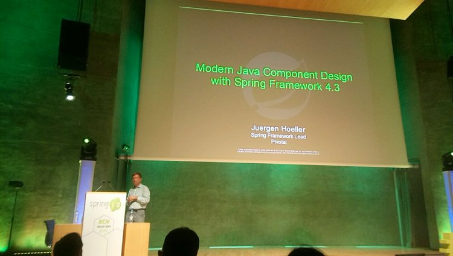
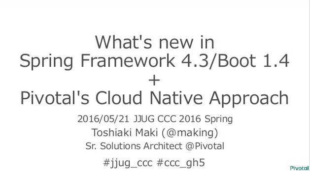
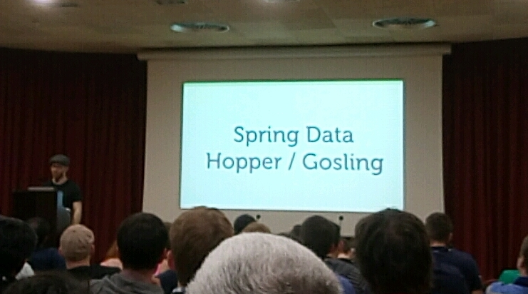
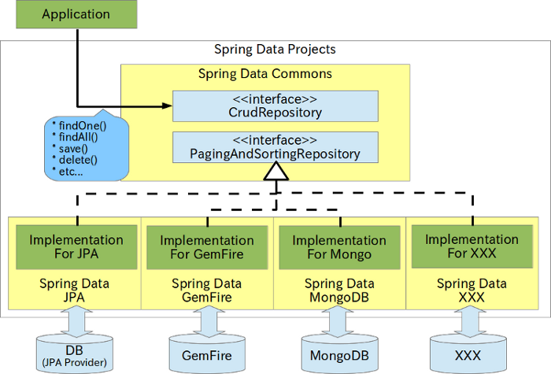
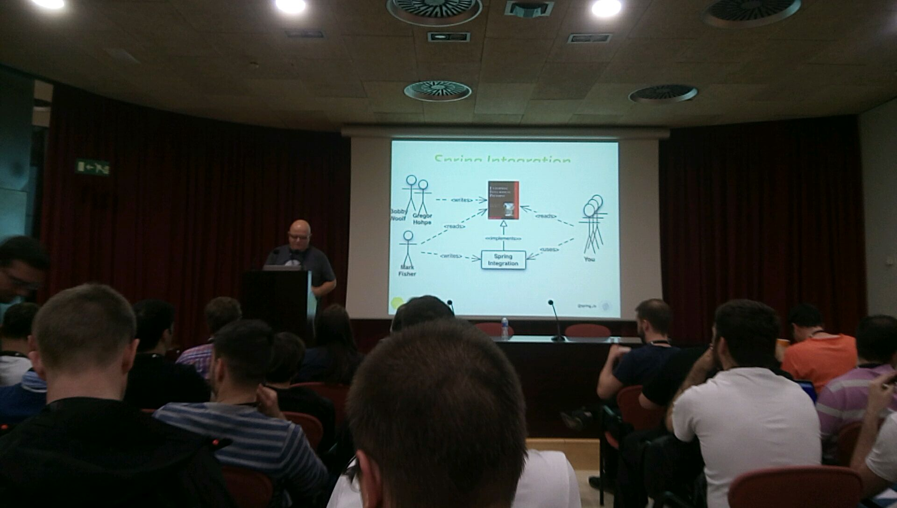

Spring I/O 2016報告会
=====

* Spring 4.3の新機能
* Spring Data、Spring Integrationの紹介

2016/6/22 JSUG

### 自己紹介

* 池谷 智行（いけや ともゆき）
* BASIC→VB→VC++→Java
* フレームワークに興味を持ち、なぜかSIerに入社@2010
* JSUGの幹事を手伝ってます。
* [「Spring徹底入門(翔泳社)」](http://www.shoeisha.co.jp/book/detail/9784798142470)の執筆に参加しました。

### agenda

* **Spring 4.3の新機能**
* Spring Dataの新機能
* Spring Integrationを使ってみよう

### Spring 4.3の新機能

* おなじみとなったJuergen氏による「Modern Java...」



* Rossen氏の「SPRING 4 WEB APPS AND BEYOND」の一部でも

### Spring 4.3の新機能



* [すでにJJUG CCC 2016 Springにて紹介されています！](http://www.slideshare.net/makingx/jjugccc-cccgh5-whats-new-in-spring-framework-43-boot-14-pivotals-cloud-native-approach)
* より詳細は
    * [公式リファレンス](http://docs.spring.io/spring/docs/4.3.0.RELEASE/spring-framework-reference/htmlsingle/)
    * [@kazuki43zoo氏による日本語解説](http://qiita.com/kazuki43zoo/items/8cee2692dcf3d70ad538)

### 紹介するSpring 4.3の新機能

|分類    |新機能      |
|:-----------|:-----------|
|Container   |コンストラクタの``@Autowired``省略に対応|
|Web         |各種合成アノテーションの提供|
|            |暗黙的なHEADとOPTIONSのレスポンス作成|
|            |``@SessionAttribute``や``@RequestAttribute``の追加|
|Boot/Test   |別セッションで|

### コンストラクタの``@Autowired``省略

```java
@Service
public class MyBookService {
  private MyBookRepository repository;

  // @Autowired <- 省略可能となった
  public MyBookService(MyBookRepository repository) {
    this.repository = repository;
  }
}
```

### コンストラクタの``@Autowired``省略

* Lombokを使用してBeanのコンストラクタを生成する場合

```java
// @RequiredArgsConstructor(onConstructor = @__(@Autowired)) 
// @Autowiredをコンストラクタに付けるために必要だった呪文が不要に
@Service
public class MyBookService {
  private MyBookRepository repository;

  // コンストラクタがLombokによりコンパイル時に生成される
}
```

### 各種合成アノテーションの提供1

* ``@RequestMapping`` の合成アノテーション
    * ``@GetMapping``, ``@PostMapping``, ``@PutMapping``, ``@DeleteMapping``, ``@PatchMapping``
    * HEADとOPTIONSが無い理由は後ほど
* **アノテーションがシンプルに！**

```java
// Before
@RequestMapping(value = "/books", method = RequestMethod.GET)
public String getBooks() {...}

// After
@GetMapping("/books")
public String getBooks() {...}
```

### 各種合成アノテーションの提供2

* ``@Scope`` の合成アノテーション
    * ``@RequestScope``, ``@SessionScope``, ``@ApplicationScope``
* **アノテーションがシンプルに！(大事なのでもう一度)**

```java
// Before
@Scope(value = WebApplicationContext.SCOPE_SESSION,
        target = ScopedProxyMode.TARGET_CLASS)
public class SessionScopedService { ... }

// After
@SessionScope
public class SessionScopedService { ... }
```

### 暗黙的なHEADとOPTIONSのレスポンス作成

* HEAD: GETメソッドに対するレスポンスのボディ無しで返却
* OPTIONS: Allowヘッダに、対応するHTTPメソッドの一覧を返却
* なぜ``@HeadMapping``と``@OptionsMapping``が無い？
   * -> この機能により開発者が使う必要が無くなったから

```java
@GetMapping("/books")
public String getBooks() {...}
```

```consolne
HTTP/1.1 200 OK
Server: Apache-Coyote/1.1
Allow: GET,HEAD
...
```

### ``@SessionAttribute``や``@RequestAttribute``の追加

* ``HttpSession``などへのアクセスを宣言的に実現
* ``@SessionAttributes``と間違えないように

```java
// Before
@RequestMapping(value = "/books", method = RequestMethod.GET)
public String getBooks(HttpSession session) {
   String id = (String) session.getAttribute("bookId");
   // ...
}

// After
@RequestMapping("/books")
public String getBooks(@SessionAttribute("bookId") String bookId) {
   String id = bookId;
   // ...
}
```

### Spring 4.3 個人的な感想

* Spring 4.2に比べると大きな機能追加はない（行き着くところまで行き着いた？）
* よく使う合成アノテーションを提供することでコード量をスマートに
    * Spring 4.3へUpdateした既存アプリのアノテーションは合成アノテーションに変えるべき？


### agenda

* Spring 4.3の新機能
* **Spring Dataの新機能**
* Spring Integrationを使ってみよう
 
### Spring Dataの新機能

* Oliver氏による「WHAT’S NEW IN SPRING DATA?」




### そもそもSpring Dataとは

* データアクセス層の隠蔽、抽象化を行うSpringプロジェクト**群**




### そもそもSpring Dataとは

* Release Trainの導入
    * Spring IO PlatformのSpring Dataクローズド版

|Release   |Spring     |Commons |JPA   |GemFire |MongoDB |
|:---------|:----------|:-------|:-----|:-------|:-------|
|Ingalls   |4.3?       |1.13.x? |1.11.x?|1.9.x? |1.10.x? |
|**Hopper**|**4.2**    |1.12.x  |1.10.x|1.8.x   |1.9.x   |
|Gosling   |4.1        |1.11.x  |1.9.x |1.7.x   |1.8.x   |
|Fowler    |4.0        |1.10.x  |1.8.x |1.6.x   |1.7.x   |

* [「Apache Geode で始めるSpring Data Gemfire」by Pivotal Japan北山さん](http://www.slideshare.net/akihirokitada5/apache-geode-spring-data-gemfire)


### そもそもSpring Dataとは

```java
public interface BookRepository extends CrudRepository<Book, Long> {}

public class BookService {
    @Autowired
    BookRepository repository;
    
    @Transactional(readOnly = true)
    public Book getBook(Long id) {
        return repository.findOne(id);
    }
}
```

### Spring Dataの新機能

* 近年の新機能ということで以下のCommons機能の紹介
    * Java SE8 Stream APIへの対応(Fowler~)
    * (Skip) QueryDSLの``Predicates``のWebサポート(Gosling~)
    * Query by Exampleのサポート(Hopper~)
    * Projectionsのサポート (Hopper~)
* 他にCommons以外の新機能紹介もあったが割愛

### Java SE8 Stream APIへの対応

* ``List`` -> ``Stream`` によりStream APIの恩恵を受けられる

```java
public interface PersonRepository
         extends CrudRepository<Person, String> {
  // Before
  @Query("SELECT p FROM person p")
  List<Person> findAllWithList();
  // After
  @Query("SELECT p FROM person p")
  Stream<Person> findAllWithStream();
}
```

### Java SE8 Stream APIへの対応

```java
// Before (All records are fetched before streaming)
List<Person> list = repository.findAllWithList();
list.stream().forEach(System.out::println);

// After (Fetched one by one)
repository.findAllWithStream().forEach(System.out::println);
```

* デモでは、fetchログと``println``の出力タイミングを見比べていた
    * Before:
        * fetch -> fetch -> fetch -> println -> println -> println
    * After
        * fetch -> println -> fetch -> println -> fetch -> println

### Query by Exampleのサポート

* Example = DSLを使用しないシンプルなクエリ

```java
// last nameが"White"のユーザを検索するクエリ
Example<User> example = Example.of(new User(null, "White", null));
int countMatches = userRepository.count(example);
List<User> usersMatches = userRepository.findAll(example);
```

```java
public interface PersonRepository
         extends CrudRepository<User, String>,
                 QueryByExampleExecutor<User> {
}
```

### Projectionsのサポート

* 読み込んだmodelのプロパティを任意のインターフェイスへ射影する機能

```java
@Entity
public class Person {
  @Id @GeneratedValue private Long id;
  private String firstName, lastName;
  private String street, state, country;
  // …
}
```

```java
// Before
Person person = personRepository.findOne(id);
String fullName = person.getFirstName() + " " + person.getLastName();
```

### Projectionsのサポート

* 知りたいデータをインターフェイスとアノテーションで定義
* JPAの場合は、JPQLが実行時に最適化される(らしい)

```java
public interface FullName {
  @Value("#{target.firstName} #{target.lastName}")
  String getFullName();
}

public interface PersonRepository
        extends CrudRepository<Person, Long> {
  FullName findProjectedById(Long id);
}
```

```java
// After
String fullName = personRepository.findOne(id).getFullName();
```

### agenda

* Spring 4.3の新機能
* Spring Dataの新機能
* **Spring Integrationを使ってみよう**


### Spring Integrationを使ってみよう

* Gary氏による「SPRING INTEGRATION WITH SPRING BOOT AND RABBITMQ」



### Spring Integrationとは

### Spring Integrationとは

### デモのポイント

* DSL
* RabbitMQとの連携
