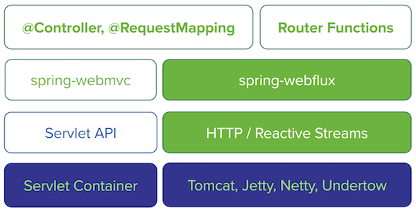

Spring I/O 2017報告会
=====

* Functional Web Framework
* Spring DataのReactive対応

2017/6/29 JSUG勉強会

### 自己紹介

* 池谷 智行（いけや ともゆき）
* 某大手SIerに入社@2010
* JSUGの幹事を手伝ってます。
* [「Spring徹底入門(翔泳社)」](http://www.shoeisha.co.jp/book/detail/9784798142470)の執筆に参加しました。
* Spring I/Oは3回目の参加 

### 元ネタセッション

| Session                 | Speaker    |
|:------------------------|:-----------|
|Reactor 3, the reactive foundation for Java 8 (and Spring 5) | Simon Baslé |
|New in Spring 5: Functional Web Framework                    | Arjen Poutsma |
|Reactive Meets Data Access                                   | Christoph Strobl |

http://lanyrd.com/2017/spring-io/

### お詫び

槙さん講演＠Java Day Tokyo 2017  
[「Spring Framework 5.0によるReactive Web Application」](http://www.oracle.com/technetwork/jp/ondemand/online2017-javaday-3719599-ja.html)

の激しい劣化版に結果的になってしまったこと  
ご了承ください。

### agenda

* **Reactiveのおさらい**
* Functional Web Framework
* Spring DataのReactive対応

### non-blocking

* blockさせないプログラミング手法
    * callback
        * callback地獄
    * ``Future``
        * スレッドコスト
        * 待ち合わせでblock

### Reactiveとは

* 例：Excelの数式
* 誤解を恐れずに我流に言うと、
    * blockしない処理の塊を細切れにする
    * エンジンは、細切れ処理をいつでも実行可能できるよう管理
    * エンジンは、イベントループの中で
        * 細切れ処理の実行優先順位をつける
            * 入力側のイベント発生や、出力側の待ち状況に応じて
        * 細切れ処理を優先順に実行

本当のリアクティブプログラミングの詳細は、  
[NTTの岩塚さん、堅田さんのスライド](https://www.slideshare.net/TakuyaIwatsuka/spring-5)


### Reactive(Streams)とは

* Reactiveライブラリの共通部分を標準化
* JDK9に取り込まれる予定
* back pressureにより合理的に処理を実行
    * 急いでいるSubscriberには素早く
    * ゆっくりなSubscriberには手を抜く
    * push型/pull型の弱点を補う

```
Publisher ---[onNext()]--> Subscriber
          <--[request()]--
```


### MonoとFlux (Reactor)

* Reactorにおける``Publisher``の実装
* Reactive StreamsをStream API風に記述できる
* ``Mono``は0/1個、``Flux``は0個以上の値を発行可能

```java
Flux<String> publisher = Flux.just("aaa", "bbb", "ccc")
        .map(String::toUpperCase).repeat(2);

publisher.subscribe(System.out::print);

// AAABBBCCCAAABBBCCC
```

### Spring5でのReactive

* Spring5で追加されたspring-webfluxモジュール
    * Spring MVCでReactorの``Mono``や``Flux``が利用可能に。




https://docs.spring.io

### Spring5でのReactive

* リクエストとレスポンスへのアクセスをReactiveに

```java
@RestController
public class EchoController {
  @PostMapping("/echo")
  Flux<String> upperCase(@RequestBody Flux<String> body) {
    return body.map(String::toUpperCase);
  }
}
```

### 無限ストリームの返却(Server Sent Event)

* AcceptヘッダがSSEの場合は```Flux```をSSEのStreamとして解釈

```java
@GetMapping("/infinite")
Flux<Long> infinite() {
    return Flux.interval(Duration.ofSeconds(1));
}
```

```console
curl http://... -H "Accept: text/event-stream"
data:0

data:1

data:2
...
```

### agenda

* Reactiveのおさらい
* **Functional Web Framework**
* Spring DataのReactive対応

### Overview

* 以下のコンセプトの新たなWebフレームワーク
    * ``java.util.function``や``java.util.stream``などの関数スタイル記述
    * framework << library (明示的かつカスタムが容易)
    * No reflection
    * spring-webflux向け限定

* ``RouterFunction``と``HandlerFunction``の組み合わせ

### RouterFunction

* いわゆるルーター
* URLやリクエスト内容に応じて、呼び出す処理の振り分けルールを定義
    * リクエストの条件マッチングには``RequestPredicates``を使用
* ``@RequestMapping``相当
* Bean定義しておけば有効化される

```java
RouterFunction<ServerResponse> router = RouterFunctions.route(
                RequestPredicates.GET("/func1"), handler1)
                .andRoute(RequestPredicates.GET("/func2"), handler2);
```

### HandlerFunction

* ルーターで条件にマッチした場合に呼び出される処理を定義
* リクエストハンドラ(``@RequestMapping``が付与されたメソッド)に相当

```java
HandlerFunction<ServerResponse> handler = req -> {
    return ServerResponse.ok().body(
            Mono.just(req.queryParam("query").get()),
            String.class);
};
```

* request/responseへのアクセスには以下を用いる
    * ``ServerRequest``: ``RouterFunction``から取得可能
    * ``ServerResponse``: ``HandlerFunction``の戻り値へ返却 


### Example

* ``RouterFunction``をBean化することで有効になる

```java
@Bean
RouterFunction<ServerResponse> router() {
    return RouterFunctions.route(POST("/func"),
            req -> ServerResponse.ok().body(
                    req.bodyToFlux(String.class)
                           .map(String::toUpperCase), String.class));
}
```


### HandlerFilterFunction

* 横断的な処理の挟み込み
    * ``HandlerInterceptor``に相当

```java
@Bean
RouterFunction<ServerResponse> routerWithFilter() {
    return RouterFunctions.route(POST("/filter1"),
            req -> ServerResponse.ok().body(
                    req.bodyToFlux(String.class)
                            .map(String::toUpperCase), String.class))
            .andRoute(POST("/filter2"),
                    req -> ServerResponse.ok().body(
                            req.bodyToFlux(String.class), String.class))
            .filter((req, handler) -> {
                System.out.println(req.headers().contentLength());
                return handler.handle(req);
            });
}
```

### Question

* Q: ``@RequestMapping``があるのになぜ？
    * A: 様々な選択肢があることは重要なのだ by キーノート
    * A: Reactiveだと関数スタイルとの相性が良い？


### agenda

* Reactiveのおさらい
* Functional Web Framework
* **Spring DataのReactive対応**

### Spring Data 2.0 

* リリーストレインはKay
    * GA on July 2017
* APIの破壊的変更
* Reactive対応
    * Reactive Template API
    * Reactive Repository


### APIの破壊的変更

* 戻り値``null``の可能性のあるAPIは全て``Optional``型で返却
* IDの``Serializable``制約の廃止
* Repositoryのメソッド名の改善
    * ``save(..)`` -> ``saveAll(..)``
    * ``findOne(..)`` -> ``findById(..)``
* Custom Repositoryの命名ルールの改善
    * ``MyRepositoryCustom`` -> ``MyRepositoryImpl``


### Reactive Template API

```java
ReactiveMongoTemplate template;

Flux<Person> flux = template.find(
    new Query(where("_id").is(person.getId())), Person.class);

flux.subscribe(System.out::println);
```

### ReactiveCrudRepository

```java
<S extends T> Mono<S> save(S entity);
<S extends T> Flux<S> saveAll(Publisher<S> entityStream);
Mono<T> findById(ID id);
Flux<T> findAll();
Mono<Long> count();
...
```

### データソース毎のReactive対応状況

| Data Source  | Reactive Support |
|:-------------|:-----------------|
| JPA(JDBC)    |**NG**            |
| Redis        |**OK**            |
| MongoDB      |**OK**            |
| Apache Cassandra |**OK**         |
| Couchbase    |**OK**         |

### JPA(JDBC)でのReactiveはなぜNG？

* JDBCドライバやJPA実装がReactiveに対応していないため
    * 他部分をReactiveにしてもblockが残ってしまっては意味がない

### 画面レンダリングのReactiveは？

次のセッションにてご紹介！
